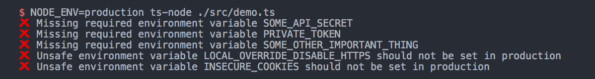

# `check-env`

Check that the critical environment variables are set for your app,
and that you did not leave dangerous development overrides in production.

[](https://www.npmjs.com/package/@47ng/check-env)
[](https://github.com/47ng/check-env/blob/next/LICENSE)
[](https://github.com/47ng/check-env/actions)
[](https://coveralls.io/github/47ng/check-env?branch=next)
[](https://dependabot.com)

## Installation

```
yarn add @47ng/check-env
```

## Usage

```js
import checkEnv from '@47ng/check-env'

checkEnv({
  // Will log an error and throw if any of these are missing:
  required: [
    'SOME_API_SECRET',
    'PRIVATE_TOKEN',
    'SOME_OTHER_IMPORTANT_THING'
    // ...
  ],

  // Will log an error and throw if any of these are set in production:
  unsafe: [
    'LOCAL_OVERRIDE_DISABLE_HTTPS',
    'INSECURE_COOKIES'
    // ...
  ]
})
```

If some required environment variable are not set, it will tell you and throw
an error at the end:


## Error handling

You can choose to skip throwing an error with the `noThrow` option:

```js
checkEnv({
  noThrow: true,
  ...
})
```

## Logging

By default, `check-env` uses `console.err` with emoji.

You can override the default logging methods with `logMissing` and `logUnsafe`.

Example using [Pino](https://github.com/pinojs/pino):

```js
const logger = require('pino')()

checkEnv({
  logMissing: name => logger.error(`Missing required environment variable ${name}`),
  logUnsafe: name => logger.warn(`Unsafe environment variable ${name} set in production`),
  ...
})
```

## License

[MIT](https://github.com/47ng/check-env/blob/master/LICENSE) - Made with ❤️ by [François Best](https://francoisbest.com) - [Donations welcome](https://paypal.me/francoisbest?locale.x=fr_FR) 🙏
